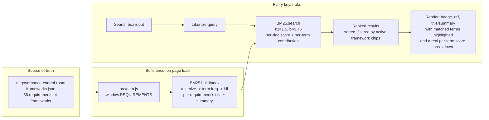

<p align="center"></p>

<div align="center">

# reg-search

**Natural-language search over 56 real, cited requirements across the EU AI Act, GDPR, ISO/IEC 42001
and NIST AI RMF — ranked with a BM25 implementation written from scratch.**
No embeddings. No external model. No API key. No server.

[](https://jeevan-0508.github.io/reg-search/)
[](LICENSE)
[](src/bm25.test.js)
[](#whats-real)

</div>

## How it works



Everything above the fold runs in one page load: 56 requirements are tokenized and indexed once,
then every keystroke re-scores the same index against the new query. There is nothing to deploy,
nothing to call, and nothing to key in — the honest lexical-search version of the same data model
behind [AI Risk Control Room](https://jeevan-0508.github.io/ai-governance-control-room/).

## Why BM25 and not an embedding model

Every other search-shaped tool on this profile that touches AI reasoning is upfront about calling out
to a model with a key you provide. This one deliberately isn't one of those: it's the search algorithm
underneath Lucene and Elasticsearch's default ranker, built here to understand it rather than call it.
Term frequency, inverse document frequency, and length normalisation are enough to make "human oversight
high-risk systems" surface Article 14 over a GDPR breach-notification clause, and the page shows exactly
which query terms actually matched, not just a bare score.

The honest limit that comes with that choice: it is lexical, not semantic. It will not know that
"automated decision-making" and "algorithmic profiling" are related unless both phrases appear in the
requirement text. A future version could layer a small BYOK embedding call on top for that, the same
pattern already live in [risk-swarm](https://github.com/Jeevan-0508/risk-swarm) and
[shadow-network](https://github.com/Jeevan-0508/shadow-network) — not built here on purpose, so this stays
a clean example of the lexical half on its own.

## What's real

- **56 requirements**, copied from [ai-governance-control-room](https://github.com/Jeevan-0508/ai-governance-control-room)'s
  `data/frameworks.json` — that repo is the source of truth; this one's copy is kept in sync by hand.
- **`src/bm25.js`** — tokenizer, inverted-index-free BM25 scorer (`k1=1.5`, `b=0.75`, the field's own
  standard defaults), 14 tests covering tokenization, idf weighting, ranking order, per-term
  contribution, zero-match queries and determinism.
- **`src/app.js`** — wires the search box, the per-framework filter chips, and result rendering to the
  index, including a real per-term score breakdown next to each result (not an estimate — the exact
  addend that went into that result's BM25 score). No framework, no build step.

## Run it

Open `index.html` directly, no server needed — `data.js` and `bm25.js` are plain scripts, not ES
modules or `fetch()` calls, so this works double-clicked from disk exactly like it does on GitHub Pages.

```
bun test        # 14 tests
```

## Not yet done

- BYOK semantic layer as an optional second ranking pass alongside BM25, so a query with no literal
  term overlap could still surface a conceptually related requirement.
